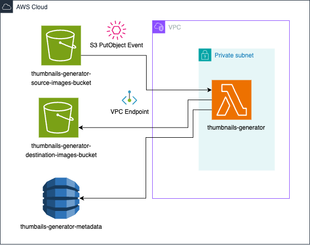

# Thumbnails Generator - Coding Challenge Stori
***
Este proyecto consiste en el diseño de una arquitectura de datos para un generador de miniaturas utilizando servicios en la nube. El sistema toma imágenes grandes como entrada y genera versiones más pequeñas (miniaturas) como salida.
## Descripción del proyecto
***
1. **Recepción de imágenes**: Se asume que las imágenes son proporcionadas por una fuente de datos externa (como un bucket de S3 o una API).
2. **Generación de miniatura**s: Las imágenes recibidas son procesadas para crear versiones más pequeñas utilizando una herramienta de procesamiento de imágenes.
3. **Almacenamiento en la nube**: Las miniaturas generadas son almacenadas en un bucket de destino en la nube.
4. **Despliegue**: El servicio es desplegado utilizando una herramienta de infraestructura como código (IaC).

## Arquitectura
***
El sistema se basa en una arquitectura **serverless** basada en eventos utilizando los siguientes componentes:

- **Amazon S3**: Para recibir y almacenar imágenes grandes y miniaturas.
- **Lambda Functions**: Para procesar las imágenes y generar las miniaturas de manera automática cuando se suben imágenes nuevas por medio de un evento de S3.
-**Infraestructura como código (IaC)**: El despliegue se realiza utilizando CDK para garantizar la consistencia y escalabilidad del sistema.

<p align="center">
  
</p>

## Herramientas y Tecnologías
***
-**Python**: Para escribir el código del generador de miniaturas.
-**Pillow**: Librería de Python utilizada para procesar imágenes.
-**Amazon Web Services (AWS)**: Servicios utilizados incluyen S3, Lambda y CDK para el despliegue. 

## Instalación y Despliegue

Sigue estos pasos para desplegar el servicio:

1.	Clona el repositorio:
    ```git clone https://github.com/danielOwl24/stori.git```
    ```cd stori```
2. Instalar Node.js
3. Verificar instalación de Node.js
    ```node -v```
    ```npm -v```
3. Instalar AWS CDK
    ```npm install -g aws-cdk```
4. Verificar instalación de AWS CDK
    ```cdk --version```
5. Crea un entorno virtual para instalar las dependencias, esto puede variar de un sistema operativo a otro, para este caso se desarrolló en macOS.
   ```python3 -m venv $environment_name$```
6. Activa el entorno virtual.
    ```source environment_name/bin/activate```
7. Instala las dependecias del proyecto.
    ```pip install -r requirements.txt```
8. Configura las credenciales de AWS. Es necesario tener instalado AWS CLI.
    ```aws config```
9. Configura las variables de entorno como la cuenta de AWS, la región, etc; las cuales son necesarias para la ejecución de la aplicación. La forma de crear estas variables de entorno depende del sistema operativo.
10. Ejecutar el comando bootstrap para desplegar la aplicación por primera vez y arrancar el proyecto con las configuraciones de AWS ingresadas anteriormente.
    ```cdk bootstrap```
11. Lista los stacks del CDK actual.
    ```cdk list```
12. Ejecuta el siguiente comando para que CloudFormation lleve a cabo una validación previa del código del stack antes del despliegue.
    ```cdk synth```
13. Desplegar la infraestructura configurada en la aplicación de CDK por medio de CloudFormation en la cuenta de AWS.
   ```cdk deploy```
14. Validar que los servicios se hayan desplegado correctamente en AWS.

